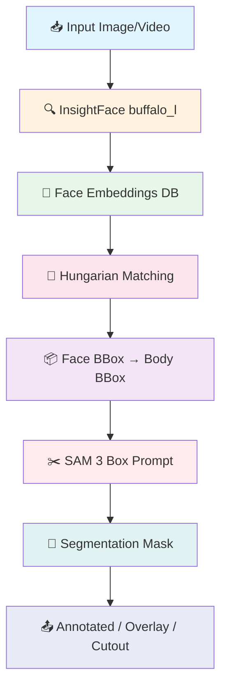
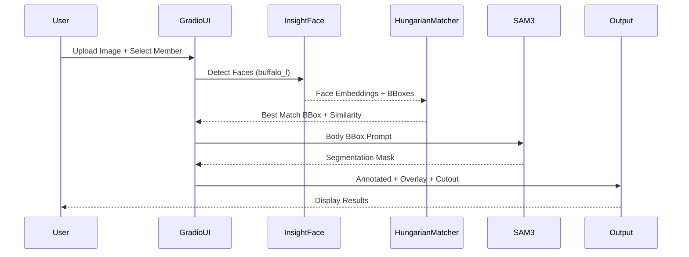

# 🎭 Identity-Aware Segmentation with SAM 3 & InsightFace

<p align="center">
  
  
  
  
  
</p>

<p align="center">
  <b>ระบบ Segmentation ที่รู้จำตัวตน โดยใช้ SAM 3 ร่วมกับ InsightFace สำหรับการแยกสมาชิกวง IVE</b>
</p>

---

## 📋 Table of Contents

- [Overview](#overview)
- [Features](#features)
- [Architecture](#architecture)
- [Project Structure](#project-structure)
- [Installation](#installation)
- [Usage](#usage)
- [Hardware Requirements](#hardware-requirements)
- [Troubleshooting](#troubleshooting)

---

## 🎯 Overview

โปรเจคนี้เป็นระบบ **Identity-Aware Segmentation** ที่ผสมผสานเทคโนโลยีสองตัวหลัก:

1. **InsightFace (buffalo_l)** — Face Detection + ArcFace Recognition เพื่อระบุตัวตนจากใบหน้า
2. **SAM 3 (Segment Anything Model 3)** — Segmentation ที่แม่นยำโดยใช้ Box Prompt

ระบบสามารถ:
- ระบุตัวตนสมาชิกวง IVE ทั้ง 6 คน จากใบหน้าในภาพ
- ขยาย Face Bounding Box เป็น Body Bounding Box แล้วส่งเข้า SAM 3
- คืนผลลัพธ์ 3 แบบ: **Annotated**, **Overlay**, **Cutout**
- ประมวลผลวิดีโอ frame-by-frame พร้อม IoU Tracking และ Temporal Smoothing
- มี Web UI ผ่าน Gradio

---

## ✨ Features

### 👤 Identity Matching
- Hungarian Algorithm จับคู่ใบหน้ากับสมาชิก (ป้องกัน duplicate assignment)
- Cosine Similarity บน L2-normalized ArcFace embeddings
- Embedding database สร้างจากรูป reference หลายรูปต่อคน (เฉลี่ย avg embedding)

### 🖼️ Image Segmentation
- Face bbox → Body bbox (ขยายด้วย scale parameters ที่ปรับได้)
- SAM 3 Box Prompt → Segmentation mask
- Output: Annotated image, Color overlay, RGBA cutout

### 🎬 Video Processing
- Frame sampling (ทุก N frames) เพื่อประหยัดเวลา
- `SimpleTracker` — IoU-based tracking รักษา identity ข้าม frames
- `TemporalSmoother` — เฉลี่ย mask ย้อนหลัง 5 frames ลด flickering

### 🎨 Gradio Web UI
- **Tab 1: Segment Member** — อัปโหลดภาพ + เลือกสมาชิก → ได้ Annotated / Segmented / Cutout
- **Tab 2: Identify All** — แสดงทุกคนที่ detect ได้พร้อม similarity score

---

## 🏗️ Architecture



### Data Flow



---

## 📁 Project Structure

```
Segmentation_Ive/
├── 📁 Dataset/                     # รูป reference สำหรับสร้าง embeddings
│   ├── An_Yujin/                   #   → Yujin   (16 faces)
│   ├── Jang_Wonyoung/              #   → Wonyoung (22 faces)
│   ├── Kim_Gaeul/                  #   → Gaeul   (18 faces)
│   ├── Kim_Jiwon/                  #   → Liz     (25 faces)
│   ├── Lee_Hyunseo/                #   → Leeseo  (24 faces)
│   └── Naoi_Rei/                   #   → Rei     (17 faces)
├── 📁 Input/                       # วิดีโอ/ภาพ input สำหรับ inference
│   └── IVE-30s.mp4
├── 📁 outputs/                     # ผลลัพธ์วิดีโอที่ประมวลผลแล้ว
│   └── segmented_*.mp4
├── 📁 sam3/                        # SAM 3 repository (git clone แยก)
├── 📁 insightface_models/          # InsightFace model weights (auto-download)
├── 📁 scripts/                     # Setup scripts
│   └── setup.sh                    #   → Auto-setup script สำหรับเครื่องใหม่
├── main.ipynb                      # 📌 Main notebook (entry point ทุกอย่าง)
├── requirements.txt                # Python dependencies (มี setuptools<70)
├── README.md                       # เอกสารนี้
└── .gitignore
```

> **หมายเหตุ:** `sam3/`, `insightface_models/`, และ `.venv/` ไม่ได้อยู่ใน git — ต้อง setup เองตาม Installation

---

## 🚀 Installation

### Prerequisites

- **GPU**: NVIDIA GPU ที่รองรับ CUDA 12.x (แนะนำ 16GB+ VRAM)
- **Python**: 3.10+
- **OS**: Linux (Ubuntu 20.04+) หรือ Windows

### ⚡ Quick Start (Recommended)

สำหรับเครื่องใหม่ ใช้ script นี้เพื่อติดตั้งอัตโนมัติ:

```bash
# 1. Clone repository (ถ้ายังไม่มี)
git clone <your-repo-url>
cd SEGMENTATION_IVE

# 2. รัน setup script
chmod +x scripts/setup.sh
./setup.sh
```

Script จะทำการ:
- ✅ ติดตั้ง system dependencies (cmake, python3-dev, ffmpeg, etc.)
- ✅ สร้าง Python virtual environment
- ✅ ติดตั้ง PyTorch with CUDA 12.1
- ✅ ติดตั้ง Python dependencies ทั้งหมด
- ✅ Clone และติดตั้ง SAM 3
- ✅ ตรวจสอบการติดตั้ง

### 🛠️ Manual Installation

หากต้องการติดตั้งเอง ทำตามขั้นตอนนี้:

#### 1. ติดตั้ง System Dependencies (Ubuntu/Debian)

**⚠️ สำคัญมาก:** `insightface` ต้องการ compile C++ extensions จำเป็นต้องติดตั้ง:

```bash
sudo apt-get update
sudo apt-get install -y cmake python3-dev python3-pip python3-venv python3.10-venv build-essential ffmpeg libgl1 git
```

| Package | เหตุผล |
|---------|--------|
| `cmake` | ใช้ build C++ extensions ของ insightface |
| `python3-dev` | Python header files สำหรับ compile C modules |
| `python3.10-venv` | สำหรับสร้าง Python 3.10 virtual environment |
| `build-essential` | GCC, G++ compilers |
| `ffmpeg` | สำหรับประมวลผลวิดีโอ |
| `libgl1` | OpenCV ต้องใช้ |

#### 2. สร้าง Virtual Environment

```bash
# ใช้ venv (แนะนำ)
python3 -m venv .venv
source .venv/bin/activate

# หรือใช้ conda
conda create -n sam3-face python=3.10 -y
conda activate sam3-face
```

#### 3. ติดตั้ง PyTorch with CUDA 12.6

```bash
pip install torch torchvision torchaudio --index-url https://download.pytorch.org/whl/cu126
```

#### 4. ติดตั้ง Dependencies

```bash
pip install -r requirements.txt
```

**หมายเหตุ:** `insightface` อาจใช้เวลา compile 5-10 นาที เนื่องจากไม่มี pre-built wheel สำหรับ Linux

#### 5. Clone และติดตั้ง SAM 3

```bash
# Clone ไว้ใน root ของโปรเจค
git clone https://github.com/facebookresearch/sam3.git
cd sam3
pip install -e ".[notebooks]"
cd ..
```

> SAM 3 จะถูก load จาก `./sam3/` ผ่าน `sys.path` โดยตรง — ไม่ได้ใช้ HuggingFace transformers

#### 5. HuggingFace Token (สำหรับ SAM 3 weights)

```bash
# วิธีที่ 1
huggingface-cli login

# วิธีที่ 2
export HF_TOKEN="your_token_here"
```

ต้องยอมรับ license ของ SAM 3 ที่ HuggingFace ก่อน (model จะ download อัตโนมัติครั้งแรกที่รัน)

#### 6. InsightFace Models

InsightFace จะ download `buffalo_l` อัตโนมัติลงใน `./insightface_models/` ครั้งแรกที่รัน

---

## 💻 Usage

### รัน Notebook

```bash
jupyter notebook main.ipynb
```

รัน cell ตามลำดับ Section 1 → 7:

| Section | เนื้อหา |
|---------|---------|
| **1. Environment Setup** | ติดตั้ง dependencies, clone SAM 3, login HF, verify GPU |
| **2. Face Embedding Database** | โหลด InsightFace, สร้าง embeddings จาก `Dataset/` |
| **3. Identity Matching** | Hungarian matching + cosine similarity functions |
| **4. SAM 3 Engine** | โหลด SAM 3, ฟังก์ชัน `segment_by_box()` |
| **5. Integration Pipeline** | `face_to_body_bbox()`, `segment_member()`, overlay/cutout |
| **6. Gradio UI** | `demo.launch(share=True)` → เปิด browser |
| **7. Video Inference** | `SimpleTracker`, `TemporalSmoother`, `process_video()` |

### Gradio Web UI

หลังรัน Section 6 เปิด browser ที่ `http://127.0.0.1:7861`

#### Tab 1: Segment Member
1. อัปโหลดภาพที่มีสมาชิก IVE
2. เลือกสมาชิกจาก dropdown: `Wonyoung / Yujin / Gaeul / Liz / Leeseo / Rei`
3. กด **Segment** → ได้ผล 3 แบบ

#### Tab 2: Identify All
1. อัปโหลดภาพ
2. กด **Identify All** → แสดงทุกคนที่ detect ได้พร้อม similarity score

### Video Processing (Section 7)

```python
process_video(
    input_path="Input/IVE-30s.mp4",
    output_path="outputs/segmented_wonyoung.mp4",
    target_member="Wonyoung",
    frame_sampling=5       # ประมวลผลทุก 5 frames
)
```

### Programmatic API

```python
# Segment สมาชิกจากภาพ
overlay, cutout, annotated, mask, status = segment_member(
    image_bgr=cv2.imread("image.jpg"),
    member_name="Wonyoung",
    similarity_threshold=0.45
)

# Identify ทุกคนในภาพ
members = identify_all_members(image_bgr, face_analyzer, embeddings_db)
# returns: [{'name': 'Wonyoung', 'bbox': [...], 'similarity': 0.73}, ...]
```

---

## 🖥️ Hardware Requirements

### Minimum
| Component | Specification |
|-----------|--------------|
| GPU | NVIDIA GPU ที่รองรับ CUDA 12.x, 12GB+ VRAM |
| RAM | 32GB |
| Storage | 20GB+ (SAM 3 weights ~5GB) |

### Tested Setup (RTX 6000)
| Component | Specification |
|-----------|--------------|
| GPU | NVIDIA RTX 6000 Ada Generation |
| VRAM | 47.37 GB |
| CUDA | 12.6 |
| Compute Capability | 8.9 (bfloat16 supported) |

### Performance (RTX 6000)

| Task | Detail | Time |
|------|--------|------|
| Image Segmentation | 1 member, 1 image | ~0.5s |
| Video (30s @ 5 fps sampling) | 1080p, 1 member | ~2–3 min |

---

## 🔧 Troubleshooting

### ❌ Failed to build installable wheels for insightface

**สาเหตุ:** ขาด build dependencies (cmake, python3-dev)

**วิธีแก้:**
```bash
# Ubuntu/Debian
sudo apt-get update
sudo apt-get install -y cmake python3-dev build-essential

# แล้วลองติดตั้งใหม่
pip install insightface>=0.7.3
```

**เช็คว่าติดตั้งครบไหม:**
```bash
which cmake          # ควรแสดง path
python3-config --includes  # ควรแสดง Python headers path
```

---

### ❌ ModuleNotFoundError: No module named 'pkg_resources' (SAM 3 Import Error)

**สาเหตุ:** SAM 3 ใช้ `pkg_resources` ซึ่งถูกลบออกจาก `setuptools` v70+

**วิธีแก้:**
```bash
# Downgrade setuptools
pip install "setuptools<70"

# แล้วลอง import SAM 3 ใหม่
python3 -c "from sam3 import build_sam3_image_model; print('OK')"
```

**ป้องกัน:** ใช้ `setup.sh` หรือติดตั้ง `setuptools<70` ตั้งแต่เริ่มต้น

### CUDA Out of Memory

SAM 3 ใช้ VRAM มาก หาก OOM ให้ลด resolution ของภาพ input หรือลด batch

### SAM 3 Import Error

```bash
# ตรวจสอบว่า clone ไว้ถูกตำแหน่ง (ต้องอยู่ที่ ./sam3/ ใน root โปรเจค)
ls sam3/sam3/__init__.py

# ติดตั้งใหม่
cd sam3 && pip install -e ".[notebooks]" && cd ..
```

### InsightFace Model Download Failed

```bash
# ลบ cache แล้วให้ download ใหม่
rm -rf ./insightface_models/models/buffalo_l
# รัน cell 2 ใน notebook อีกครั้ง
```

### HuggingFace Token Error

```bash
huggingface-cli login --token YOUR_TOKEN
```

### Video Codec Error

```bash
# Linux
sudo apt-get install ffmpeg

# Windows: ดาวน์โหลด ffmpeg จาก https://ffmpeg.org/
```

### Similarity Threshold ปรับแต่ง

ค่า default `threshold=0.45` — ปรับเพิ่มถ้า false positive มาก, ปรับลดถ้า miss detection มาก:

```python
members = identify_all_members(image_bgr, face_analyzer, embeddings_db, threshold=0.40)
```

---

## 🙏 Acknowledgments

- [Meta AI — SAM 3](https://github.com/facebookresearch/sam3)
- [InsightFace](https://github.com/deepinsight/insightface)
- [Gradio](https://gradio.app/)
- [HuggingFace](https://huggingface.co/)

---

<p align="center">
  Made with ❤️ for IVE fans worldwide
</p>
