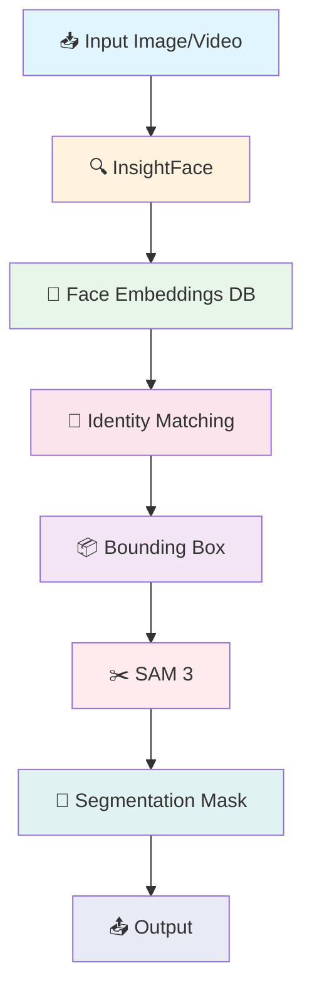
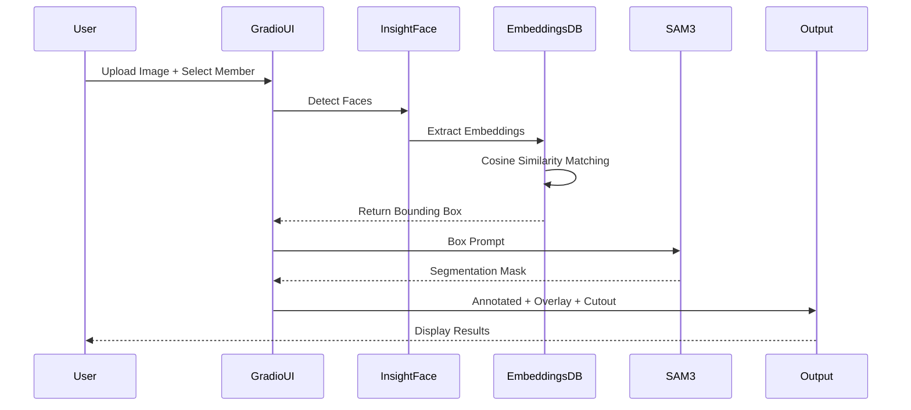

# 🎭 Identity-Aware Segmentation with SAM 3 & InsightFace

<p align="center">
  
  
  
  
  
</p>

<p align="center">
  <b>ระบบ Segmentation ที่รู้จำตัวตน โดยใช้ SAM 3 ร่วมกับ InsightFace สำหรับการแยกสมาชิกวง IVE</b>
</p>

---

## 📋 Table of Contents

- [Overview](#overview)
- [Features](#features)
- [Architecture](#architecture)
- [Installation](#installation)
- [Usage](#usage)
- [Hardware Requirements](#hardware-requirements)
- [Troubleshooting](#troubleshooting)
- [License](#license)

---

## 🎯 Overview

โปรเจคนี้เป็นระบบ **Identity-Aware Segmentation** ที่ผสมผสานเทคโนโลยีสองตัวหลัก:

1. **InsightFace** - สำหรับ Face Detection และ Face Recognition โดยใช้ ArcFace embeddings
2. **SAM 3 (Segment Anything Model 3)** - สำหรับ Segmentation ที่แม่นยำตาม prompts

ระบบสามารถ:
- ระบุตัวตนของสมาชิกวง IVE จากใบหน้า
- สร้าง segmentation mask รอบๆ บุคคลที่ต้องการ
- รองรับการประมวลผลทั้งภาพนิ่งและวิดีโอ
- ทำ association prompting (เช่น "เสื้อของ Wonyoung", "ผมของ Yujin")

---

## ✨ Features

### 🖼️ Image Segmentation
- อัปโหลดรูปภาพและเลือกสมาชิกที่ต้องการ segment
- รองรับ Box Prompt และ Text Prompt
- แสดงผล 3 รูปแบบ: Annotated, Overlay, และ Cutout

### 🎯 Advanced Prompting (Association)
- Segment วัตถุที่เกี่ยวข้องกับบุคคล (เช่น "เสื้อ", "กระโปรง", "ผม")
- ใช้ logical AND ระหว่าง person mask และ object mask

### 🎬 Video Processing
- ประมวลผลวิดีโอ frame-by-frame
- Simple tracking เพื่อรักษาความสม่ำเสมอของ identity ข้าม frames
- Temporal smoothing ลดการกระพริบของ mask
- Progress bar แสดงความคืบหน้า

### ⚡ Performance Optimizations
- `torch.compile()` สำหรับ RTX 6000
- `bfloat16` precision ประหยัด VRAM
- Batch inference สำหรับ video frames
- CUDA 12.x compatibility

---

## 🏗️ Architecture



### Data Flow



---

## 🚀 Installation

### Prerequisites

- **GPU**: NVIDIA RTX 6000 (48GB VRAM) หรือเทียบเท่า
- **CUDA**: Version 12.x
- **Python**: 3.10 หรือสูงกว่า
- **OS**: Linux (Ubuntu 20.04+ แนะนำ)

### Step-by-Step Installation

#### 1. สร้าง Conda Environment

```bash
# สร้าง environment ใหม่
conda create -n sam3-face python=3.10 -y

# เปิดใช้งาน environment
conda activate sam3-face
```

#### 2. ติดตั้ง PyTorch with CUDA 12.1

```bash
# ติดตั้ง PyTorch 2.7.0 ที่รองรับ CUDA 12.1
pip install torch==2.7.0 torchvision torchaudio --index-url https://download.pytorch.org/whl/cu121
```

#### 3. Clone Repository

```bash
# Clone โปรเจคนี้
git clone https://github.com/yourusername/sam3-identity-segmentation.git
cd sam3-identity-segmentation
```

#### 4. ติดตั้ง Dependencies

```bash
# ติดตั้ง dependencies ทั้งหมด
pip install -r requirements.txt
```

#### 5. ติดตั้ง SAM 3

```bash
# Clone SAM 3 repository
git clone https://github.com/facebookresearch/sam3.git

# เข้าไปใน directory
cd sam3

# ติดตั้ง SAM 3
pip install -e ".[notebooks]"

# กลับไปที่ root directory
cd ..
```

#### 6. HuggingFace Access Token Setup

SAM 3 ต้องการ HuggingFace token สำหรับดาวน์โหลดโมเดล:

```bash
# วิธีที่ 1: ใช้ huggingface-cli
huggingface-cli login

# วิธีที่ 2: ตั้งค่า environment variable
export HF_TOKEN="your_huggingface_token_here"

# วิธีที่ 3: ใน Python code
from huggingface_hub import login
login(token="your_huggingface_token_here")
```

**หมายเหตุ**: คุณต้องสมัครสมาชิกและยอมรับ license ของ SAM 3 ที่ [HuggingFace](https://huggingface.co/facebook/sam3) ก่อน

#### 7. Download IVE Member Embeddings

```bash
# สร้าง directory สำหรับเก็บ embeddings
mkdir -p data/embeddings

# ดาวน์โหลด pre-computed embeddings (ถ้ามี)
# หรือรัน script สร้าง embeddings จาก dataset
python scripts/create_member_embeddings.py
```

#### 8. Verify Installation

```bash
# รัน verification script
python scripts/verify_setup.py
```

---

## 💻 Usage

### 1. Launch Gradio UI

```bash
# รัน Gradio interface
python app.py

# หรือรัน Jupyter Notebook
jupyter notebook notebooks/sam3_identity_segmentation.ipynb
```

### 2. Access the UI

เปิด browser และไปที่: `http://localhost:7860`

### 3. Using the Interface

#### Tab 1: Image Segmentation
1. อัปโหลดรูปภาพที่มีสมาชิก IVE
2. เลือกสมาชิกจาก dropdown (Wonyoung, Yujin, Gaeul, Liz, Leeseo, Rei)
3. เลือกวิธี prompting (Box หรือ Text)
4. กด "Segment" button
5. ดูผลลัพธ์ทั้ง 3 รูปแบบ

#### Tab 2: Advanced Prompting
1. อัปโหลดรูปภาพ
2. เลือกสมาชิก
3. พิมพ์ชื่อวัตถุ (เช่น "shirt", "hair", "shoes")
4. กด "Segment Object"

#### Tab 3: Video Processing
1. อัปโหลดวิดีโอ
2. เลือกสมาชิก
3. ปรับ frame sampling rate (1-30 fps)
4. กด "Process Video"
5. รอจนกว่าจะเสร็จและดาวน์โหลดผลลัพธ์

### 4. API Usage (Programmatic)

```python
from src.identity_segmentation import IdentityAwareSegmentation

# Initialize system
segmenter = IdentityAwareSegmentation(
    sam3_model_size="large",  # tiny, small, base, large
    device="cuda",
    dtype="bfloat16"
)

# Segment image
result = segmenter.segment_image(
    image_path="path/to/image.jpg",
    member_name="wonyoung",
    prompt_type="box"
)

# Process video
segmenter.process_video(
    video_path="path/to/video.mp4",
    member_name="wonyoung",
    output_path="output.mp4",
    frame_sampling=5
)
```

---

## 🖥️ Hardware Requirements

### Minimum Requirements
| Component | Specification |
|-----------|--------------|
| GPU | NVIDIA GPU with 16GB+ VRAM |
| CUDA | 11.8+ |
| RAM | 32GB |
| Storage | 50GB SSD |

### Recommended (RTX 6000 Setup)
| Component | Specification |
|-----------|--------------|
| GPU | NVIDIA RTX 6000 (48GB VRAM) |
| CUDA | 12.x |
| RAM | 64GB+ |
| Storage | 100GB NVMe SSD |

### Performance Benchmarks (RTX 6000)

| Task | Resolution | Time |
|------|------------|------|
| Image Segmentation | 1024x1024 | ~0.5s |
| Video Processing (1 min) | 1080p @ 5fps | ~2 min |
| Batch Inference (32 frames) | 1024x1024 | ~8s |

---

## 🔧 Troubleshooting

### Common Issues

#### 1. CUDA Out of Memory

```python
# แก้ไข: ลด batch size หรือใช้ precision ต่ำกว่า
segmenter = IdentityAwareSegmentation(
    dtype="float16"  # หรือ "bfloat16"
)
```

#### 2. HuggingFace Token Error

```bash
# แก้ไข: Login ใหม่
huggingface-cli login --token YOUR_TOKEN

# หรือใน Python
from huggingface_hub import login
login()
```

#### 3. InsightFace Model Download Failed

```bash
# แก้ไข: ลบ cache และดาวน์โหลดใหม่
rm -rf ~/.insightface
python -c "import insightface; insightface.model_zoo.get_model('buffalo_l')"
```

#### 4. SAM 3 Import Error

```bash
# แก้ไข: ตรวจสอบว่าติดตั้ง SAM 3 ถูกต้อง
cd sam3
pip install -e ".[notebooks]"
pip install -e ".[dev]"
```

#### 5. Video Codec Error

```bash
# แก้ไข: ติดตั้ง ffmpeg
sudo apt-get update
sudo apt-get install ffmpeg libavcodec-dev libavformat-dev libswscale-dev
```

### Performance Optimization Tips

1. **ใช้ torch.compile()** (อัตโนมัติบน RTX 6000)
2. **ใช้ bfloat16** แทน float32
3. **ปิด gradient computation** เมื่อ inference
4. **ใช้ batch inference** สำหรับ video

---

## 📁 Project Structure

```
sam3-identity-segmentation/
├── 📁 data/
│   ├── 📁 embeddings/          # Face embeddings ของสมาชิก IVE
│   ├── 📁 reference_images/    # รูป reference สำหรับสร้าง embeddings
│   └── 📁 sample_videos/       # วิดีโอตัวอย่าง
├── 📁 notebooks/
│   └── sam3_identity_segmentation.ipynb  # Main notebook
├── 📁 src/
│   ├── __init__.py
│   ├── identity_segmentation.py    # Main class
│   ├── face_recognition.py         # InsightFace wrapper
│   ├── sam3_wrapper.py             # SAM 3 wrapper
│   ├── video_processor.py          # Video processing
│   └── utils.py                    # Utility functions
├── 📁 scripts/
│   ├── create_member_embeddings.py
│   └── verify_setup.py
├── 📁 outputs/                 # โฟลเดอร์สำหรับเก็บผลลัพธ์
├── app.py                      # Gradio app entry point
├── requirements.txt
├── README.md
└── .gitignore
```

---

## 🤝 Contributing

ยินดีรับ contributions! กรุณาทำตามขั้นตอน:

1. Fork repository
2. สร้าง feature branch (`git checkout -b feature/amazing-feature`)
3. Commit changes (`git commit -m 'Add amazing feature'`)
4. Push to branch (`git push origin feature/amazing-feature`)
5. เปิด Pull Request

---

## 📄 License

This project is licensed under the MIT License - see the [LICENSE](LICENSE) file for details.

**Note**: SAM 3 has its own license (Apache 2.0) and requires acceptance of terms on HuggingFace.

---

## 🙏 Acknowledgments

- [Meta AI - SAM 3](https://github.com/facebookresearch/sam3)
- [InsightFace](https://github.com/deepinsight/insightface)
- [Gradio](https://gradio.app/)
- [HuggingFace](https://huggingface.co/)

---

## 📞 Contact

สำหรับคำถามหรือปัญหา กรุณาเปิด [Issue](https://github.com/yourusername/sam3-identity-segmentation/issues) บน GitHub

---

<p align="center">
  Made with ❤️ for IVE fans worldwide
</p>
