# 🎭 Identity-Aware Segmentation with SAM 3 & InsightFace

<p align="center">
  
  
  
  
  
</p>

<p align="center">
  <b>ระบบ Segmentation ที่รู้จำตัวตน โดยใช้ SAM 3 ร่วมกับ InsightFace สำหรับการแยกสมาชิกวง IVE</b>
</p>

---

## 📋 Table of Contents

- [Overview](#overview)
- [Features](#features)
- [Architecture](#architecture)
- [Project Structure](#project-structure)
- [Installation](#installation)
- [Usage](#usage)
- [Hardware Requirements](#hardware-requirements)
- [Troubleshooting](#troubleshooting)

---

## 🎯 Overview

โปรเจคนี้เป็นระบบ **Identity-Aware Segmentation** ที่ผสมผสานเทคโนโลยีสองตัวหลัก:

1. **InsightFace (buffalo_l)** — Face Detection + ArcFace Recognition เพื่อระบุตัวตนจากใบหน้า
2. **SAM 3 (Segment Anything Model 3)** — Segmentation ที่แม่นยำโดยใช้ Box Prompt

ระบบสามารถ:
- ระบุตัวตนสมาชิกวง IVE ทั้ง 6 คน จากใบหน้าในภาพ
- ขยาย Face Bounding Box เป็น Body Bounding Box แล้วส่งเข้า SAM 3
- คืนผลลัพธ์ 3 แบบ: **Annotated**, **Overlay**, **Cutout**
- ประมวลผลวิดีโอ frame-by-frame พร้อม IoU Tracking และ Temporal Smoothing
- มี Web UI ผ่าน Gradio

---

## ✨ Features

### 👤 Identity Matching
- Hungarian Algorithm จับคู่ใบหน้ากับสมาชิก (ป้องกัน duplicate assignment)
- Cosine Similarity บน L2-normalized ArcFace embeddings
- Embedding database สร้างจากรูป reference หลายรูปต่อคน (เฉลี่ย avg embedding)

### 🖼️ Image Segmentation
- Face bbox → Body bbox (ขยายด้วย scale parameters ที่ปรับได้)
- SAM 3 Box Prompt → Segmentation mask
- Output: Annotated image, Color overlay, RGBA cutout

### 🎬 Video Processing
- Frame sampling (ทุก N frames) เพื่อประหยัดเวลา
- `SimpleTracker` — IoU-based tracking รักษา identity ข้าม frames
- `TemporalSmoother` — เฉลี่ย mask ย้อนหลัง 5 frames ลด flickering

### 🎨 Gradio Web UI
- **Tab 1: Segment Member** — อัปโหลดภาพ + เลือกสมาชิก → ได้ Annotated / Segmented / Cutout
- **Tab 2: Identify All** — แสดงทุกคนที่ detect ได้พร้อม similarity score

---

## 🏗️ Architecture

```mermaid
graph TD
    A[📥 Input Image/Video] --> B[🔍 InsightFace buffalo_l]
    B --> C[💾 Face Embeddings DB]
    C --> D[🎯 Hungarian Matching]
    D --> E[📦 Face BBox → Body BBox]
    E --> F[✂️ SAM 3 Box Prompt]
    F --> G[🎨 Segmentation Mask]
    G --> H[📤 Annotated / Overlay / Cutout]

    style A fill:#e1f5fe
    style B fill:#fff3e0
    style C fill:#e8f5e9
    style D fill:#fce4ec
    style E fill:#f3e5f5
    style F fill:#ffebee
    style G fill:#e0f2f1
    style H fill:#e8eaf6
```



### Data Flow


---

## 📁 Project Structure

```
Segmentation_Ive/
├── 📁 Dataset/                     # รูป reference สำหรับสร้าง embeddings
│   ├── An_Yujin/                   #   → Yujin   (16 faces)
│   ├── Jang_Wonyoung/              #   → Wonyoung (22 faces)
│   ├── Kim_Gaeul/                  #   → Gaeul   (18 faces)
│   ├── Kim_Jiwon/                  #   → Liz     (25 faces)
│   ├── Lee_Hyunseo/                #   → Leeseo  (24 faces)
│   └── Naoi_Rei/                   #   → Rei     (17 faces)
├── 📁 Input/                       # วิดีโอ/ภาพ input สำหรับ inference
│   └── IVE-30s.mp4
├── 📁 outputs/                     # ผลลัพธ์วิดีโอที่ประมวลผลแล้ว
│   └── segmented_*.mp4
├── 📁 sam3/                        # SAM 3 repository (git clone แยก)
├── 📁 insightface_models/          # InsightFace model weights (auto-download)
├── main.ipynb                      # 📌 Main notebook (entry point ทุกอย่าง)
├── requirements.txt
├── README.md
└── .gitignore
```

> **หมายเหตุ:** `sam3/` และ `insightface_models/` ไม่ได้อยู่ใน git — ต้อง setup เองตาม Installation

---

## 🚀 Installation

### Prerequisites

- **GPU**: NVIDIA GPU ที่รองรับ CUDA 12.x (แนะนำ 16GB+ VRAM)
- **Python**: 3.10+
- **OS**: Linux (Ubuntu 20.04+) หรือ Windows

### Step-by-Step

#### 1. สร้าง Virtual Environment

```bash
conda create -n sam3-face python=3.10 -y
conda activate sam3-face
```

#### 2. ติดตั้ง PyTorch with CUDA 12.1

```bash
pip install torch==2.7.0 torchvision torchaudio --index-url https://download.pytorch.org/whl/cu121
```

#### 3. ติดตั้ง Dependencies

```bash
pip install -r requirements.txt
```

#### 4. Clone และติดตั้ง SAM 3

```bash
# Clone ไว้ใน root ของโปรเจค
git clone https://github.com/facebookresearch/sam3.git
cd sam3
pip install -e ".[notebooks]"
cd ..
```

> SAM 3 จะถูก load จาก `./sam3/` ผ่าน `sys.path` โดยตรง — ไม่ได้ใช้ HuggingFace transformers

#### 5. HuggingFace Token (สำหรับ SAM 3 weights)

```bash
# วิธีที่ 1
huggingface-cli login

# วิธีที่ 2
export HF_TOKEN="your_token_here"
```

ต้องยอมรับ license ของ SAM 3 ที่ HuggingFace ก่อน (model จะ download อัตโนมัติครั้งแรกที่รัน)

#### 6. InsightFace Models

InsightFace จะ download `buffalo_l` อัตโนมัติลงใน `./insightface_models/` ครั้งแรกที่รัน

---

## 💻 Usage

### รัน Notebook

```bash
jupyter notebook main.ipynb
```

รัน cell ตามลำดับ Section 1 → 7:

| Section | เนื้อหา |
|---------|---------|
| **1. Environment Setup** | ติดตั้ง dependencies, clone SAM 3, login HF, verify GPU |
| **2. Face Embedding Database** | โหลด InsightFace, สร้าง embeddings จาก `Dataset/` |
| **3. Identity Matching** | Hungarian matching + cosine similarity functions |
| **4. SAM 3 Engine** | โหลด SAM 3, ฟังก์ชัน `segment_by_box()` |
| **5. Integration Pipeline** | `face_to_body_bbox()`, `segment_member()`, overlay/cutout |
| **6. Gradio UI** | `demo.launch(share=True)` → เปิด browser |
| **7. Video Inference** | `SimpleTracker`, `TemporalSmoother`, `process_video()` |

### Gradio Web UI

หลังรัน Section 6 เปิด browser ที่ `http://127.0.0.1:7861`

#### Tab 1: Segment Member
1. อัปโหลดภาพที่มีสมาชิก IVE
2. เลือกสมาชิกจาก dropdown: `Wonyoung / Yujin / Gaeul / Liz / Leeseo / Rei`
3. กด **Segment** → ได้ผล 3 แบบ

#### Tab 2: Identify All
1. อัปโหลดภาพ
2. กด **Identify All** → แสดงทุกคนที่ detect ได้พร้อม similarity score

### Video Processing (Section 7)

```python
process_video(
    input_path="Input/IVE-30s.mp4",
    output_path="outputs/segmented_wonyoung.mp4",
    target_member="Wonyoung",
    frame_sampling=5       # ประมวลผลทุก 5 frames
)
```

### Programmatic API

```python
# Segment สมาชิกจากภาพ
overlay, cutout, annotated, mask, status = segment_member(
    image_bgr=cv2.imread("image.jpg"),
    member_name="Wonyoung",
    similarity_threshold=0.45
)

# Identify ทุกคนในภาพ
members = identify_all_members(image_bgr, face_analyzer, embeddings_db)
# returns: [{'name': 'Wonyoung', 'bbox': [...], 'similarity': 0.73}, ...]
```

---

## 🖥️ Hardware Requirements

### Minimum
| Component | Specification |
|-----------|--------------|
| GPU | NVIDIA GPU ที่รองรับ CUDA 12.x, 12GB+ VRAM |
| RAM | 32GB |
| Storage | 20GB+ (SAM 3 weights ~5GB) |

### Tested Setup (RTX 6000)
| Component | Specification |
|-----------|--------------|
| GPU | NVIDIA RTX 6000 Ada Generation |
| VRAM | 47.37 GB |
| CUDA | 12.6 |
| Compute Capability | 8.9 (bfloat16 supported) |

### Performance (RTX 6000)

| Task | Detail | Time |
|------|--------|------|
| Image Segmentation | 1 member, 1 image | ~0.5s |
| Video (30s @ 5 fps sampling) | 1080p, 1 member | ~2–3 min |

---

## 🔧 Troubleshooting

### CUDA Out of Memory

SAM 3 ใช้ VRAM มาก หาก OOM ให้ลด resolution ของภาพ input หรือลด batch

### SAM 3 Import Error

```bash
# ตรวจสอบว่า clone ไว้ถูกตำแหน่ง (ต้องอยู่ที่ ./sam3/ ใน root โปรเจค)
ls sam3/sam3/__init__.py

# ติดตั้งใหม่
cd sam3 && pip install -e ".[notebooks]" && cd ..
```

### InsightFace Model Download Failed

```bash
# ลบ cache แล้วให้ download ใหม่
rm -rf ./insightface_models/models/buffalo_l
# รัน cell 2 ใน notebook อีกครั้ง
```

### HuggingFace Token Error

```bash
huggingface-cli login --token YOUR_TOKEN
```

### Video Codec Error

```bash
# Linux
sudo apt-get install ffmpeg

# Windows: ดาวน์โหลด ffmpeg จาก https://ffmpeg.org/
```

### Similarity Threshold ปรับแต่ง

ค่า default `threshold=0.45` — ปรับเพิ่มถ้า false positive มาก, ปรับลดถ้า miss detection มาก:

```python
members = identify_all_members(image_bgr, face_analyzer, embeddings_db, threshold=0.40)
```

---

## 🙏 Acknowledgments

- [Meta AI — SAM 3](https://github.com/facebookresearch/sam3)
- [InsightFace](https://github.com/deepinsight/insightface)
- [Gradio](https://gradio.app/)
- [HuggingFace](https://huggingface.co/)

---

<p align="center">
  Made with ❤️ for IVE fans worldwide
</p>
