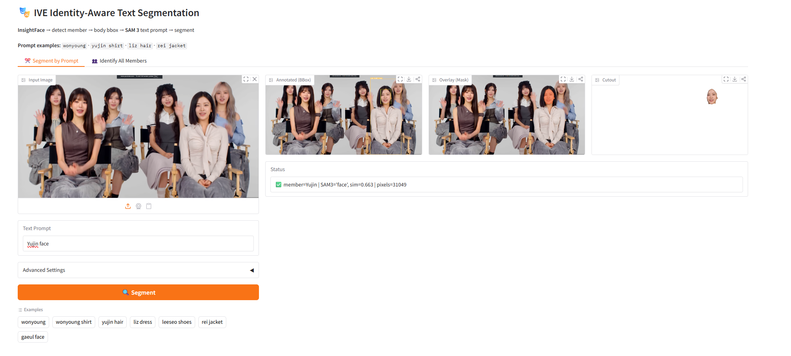
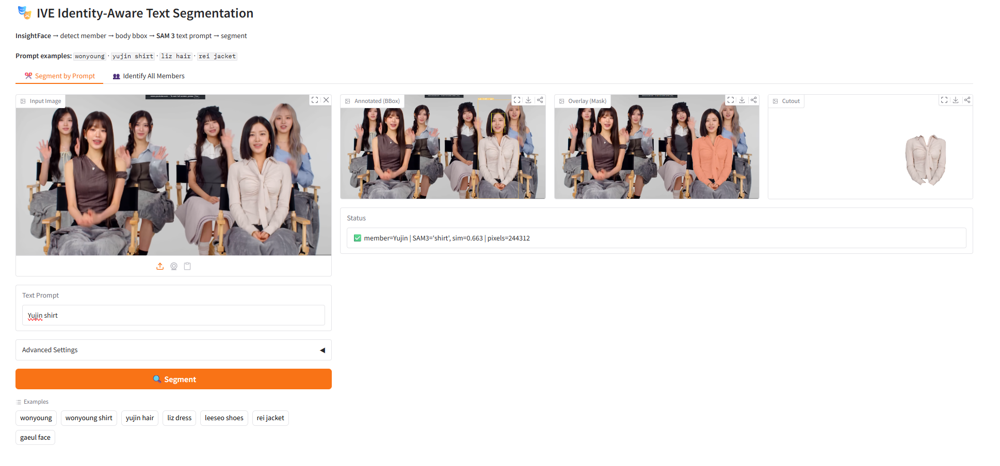

# IVE Identity-Aware Text-Prompt Segmentation
## InsightFace + SAM3 Pipeline

---

## ภาพรวมโปรเจ็ค

โปรเจ็คนี้พัฒนาระบบ segmentation ที่สามารถระบุ **ตัวตนของบุคคล (Identity)** จาก text prompt และ segment ส่วนที่ต้องการของบุคคลนั้นได้โดยอัตโนมัติ ตัวอย่างเช่น `"wonyoung shirt"` → ระบบจะหาวอนยองในภาพก่อน แล้วค่อย segment เสื้อของวอนยองเท่านั้น ไม่ใช่เสื้อของคนอื่นในภาพ

ระบบนี้ผสาน **InsightFace (ArcFace face recognition)** กับ **SAM3 (Segment Anything Model 3)** เข้าด้วยกัน เพื่อก้าวข้ามข้อจำกัดของ segmentation แบบดั้งเดิมที่มองคนเป็นแค่ "person" ไม่สามารถแยกแยะตัวตนได้

---

## โจทย์และเป้าหมาย (Hidden Agenda)

อาจารย์ออกแบบโจทย์นี้เพื่อทดสอบ 3 แนวคิดหลัก:

### 1. ก้าวข้ามจาก Object → Identity
SAM3 มาตรฐานมองทุกคนเป็น `"person"` เหมือนกันหมด โจทย์นี้ต้องการให้ระบบ **แยกคนด้วยชื่อ** ได้จริง เช่น `"wonyoung"` vs `"yujin"` vs `"gaeul"` แม้อยู่ในภาพเดียวกัน

### 2. ความเป็นเจ้าของ (Possession)
`"yujin shirt"` ต้องหมายถึงเสื้อของยูจินเท่านั้น ไม่ใช่เสื้อของคนข้างๆ ซึ่งต้องการการเชื่อมโยงระหว่าง identity กับ object ที่ตามมา

### 3. Cross-lingual Prompt
ระบบควรรองรับ prompt ในภาษาอื่นนอกจากอังกฤษ เช่น ภาษาไทย

---

## แนวทางแรกที่ลอง: Fine-tuning SAM3

### สิ่งที่ทำ
ลองเทรน SAM3 โดยตรงด้วย dataset รูปเดี่ยวของสมาชิก IVE แต่ละคน พร้อม text label ชื่อบุคคล

### ปัญหาที่พบ
- **Dataset ไม่เพียงพอ** — ต้องการข้อมูลมหาศาลเพื่อให้โมเดลเรียนรู้ความแตกต่างระหว่างบุคคล
- **Model bias** — SAM3 เทรนมาเพื่อ segment objects ไม่ใช่จำหน้าคน การ fine-tune แบบนี้ทำให้โมเดลยังคงมองทุกคนเป็น `"person"` เหมือนกัน
- **ใช้ไม่ได้กับภาพหมู่** — เมื่อมีหลายคนในภาพ โมเดลไม่สามารถแยกแยะว่าคนไหนคือ "wonyoung"

### สรุป
Fine-tuning SAM3 โดยตรงเป็น dead end สำหรับ identity-aware segmentation → เปลี่ยนแนวทาง

---

## แนวทางที่เลือก: InsightFace + SAM3 Pipeline

### 4.1 สถาปัตยกรรมโดยรวม

```
Text Prompt ("wonyoung shirt")
        ↓
  Prompt Parser
  member="Wonyoung", SAM3_text="shirt"
        ↓
  InsightFace (ArcFace)
  ตรวจจับและจำแนกใบหน้าทุกคนในภาพ
        ↓
  Face Embedding → Match กับ Database (6 members)
        ↓
  Body BBox Expansion (face bbox → ขยายครอบตัวคน)
        ↓
  SAM3 Text Segmentation ("shirt")
        ↓
  Mask Quality Scoring (confidence + proximity + overlap)
        ↓
  Remap Mask → ภาพเต็ม + Visualization
```

### 4.2 รายละเอียดแต่ละขั้นตอน

#### Prompt Parser
แปลง text prompt ให้เป็น 2 ส่วน:
- **member name** → ใช้สำหรับ InsightFace face matching
- **SAM3 text** → ใช้เป็น text prompt สำหรับ SAM3

ตัวอย่าง: `"wonyoung shirt"` → `member="Wonyoung"`, `SAM3_text="shirt"`

#### InsightFace (ArcFace Face Recognition)
- ตรวจจับใบหน้าทุกคนในภาพด้วย RetinaFace detector
- สร้าง face embedding ด้วย ArcFace model
- คำนวณ **cosine similarity** เปรียบเทียบกับ database ของสมาชิก IVE 6 คน
- **Threshold:** 0.42 — หากคะแนนต่ำกว่านี้ถือว่าไม่ match

#### BBox Expansion
ขยาย face bounding box ให้ครอบคลุมตัวคนทั้งตัว:
- **กว้าง:** ×3.0 จากความกว้างใบหน้า
- **ด้านบน:** ×1.2 (เพื่อรวมผม)
- **ด้านล่าง:** ×5.0 (เพื่อครอบร่างกาย)

#### SAM3 Text Segmentation
นำ Bbox ที่ crop มาแล้วส่งให้ SAM3 พร้อม text prompt (เช่น "shirt") เพื่อ segment วัตถุที่ต้องการภายใน Bbox เท่านั้น

#### Mask Quality Scoring
ให้คะแนน mask แต่ละชิ้นด้วย composite score:

```
composite = confidence + proximity + overlap
```

- **Confidence:** คะแนน confidence จาก SAM3
- **Proximity:** centroid ของ mask อยู่ใกล้จุดกึ่งกลาง Bboxเท่าไหร่
- **Overlap:** mask overlap กับ Bboxมากน้อยเพียงใด

ใช้ proximity score เพื่อกรอง false positive — mask ที่ centroid ใกล้กับ Bboxcenter มากกว่าจะได้ score สูงกว่า

---

## ปัญหาที่พบและวิธีแก้

### ปัญหา: BBox ขยายโดนคนข้างๆ
เมื่อสมาชิกยืนชิดกัน BBox ที่ขยายแล้วอาจครอบคลุมพื้นที่ของคนข้างๆด้วย เช่น prompt `"wonyoung hair"` แต่ SAM3 segment ผมของคนข้างๆแทน

### วิธีแก้: Proximity Score
คำนวณ centroid ของแต่ละ mask candidate แล้วเปรียบเทียบกับจุดกึ่งกลางของ Bbox— mask ที่อยู่ใกล้กับ target person มากกว่าจะได้ composite score สูงกว่า ทำให้เลือก mask ที่ถูกต้องได้แม้ว่า BBox จะทับซ้อนกัน

---

## ผลลัพธ์ (Results)

### ภาพนิ่ง

**Prompt: `"wonyoung"`** — Segment ทั้งตัววอนยอง


> SAM3 text: `"person"` | Similarity: 0.664 | Pixels: 316,909

---

**Prompt: `"yujin face"`** — Segment ใบหน้ายูจิน



> SAM3 text: `"face"` | Similarity: 0.663 | Pixels: 31,049

---

**Prompt: `"yujin shirt"`** — Segment เสื้อของยูจิน (ไม่ใช่เสื้อของคนข้างๆ)



> SAM3 text: `"shirt"` | Similarity: 0.663 | Pixels: 244,312

---

### วิดีโอ

- **`Result/all_members_video.mp4`** — Segment และแสดง BBox สมาชิก IVE ทั้ง 6 คนพร้อมกัน
- **`Result/all_members_video_remove_bbox.mp4`** — เวอร์ชันเดียวกันแต่ไม่แสดง bounding box
- **`Result/test_wonyoung.mp4`** — Prompt: `"wonyoung"` บนวิดีโอ IVE-30s.mp4 (909 frames, 78.9% detection rate)
- **`Result/test_wonyoung_hair.mp4`** — Prompt: `"wonyoung hair"` — segment ผมวอนยองในวิดีโอ
- **`Result/yujin_hair.mp4`** — Prompt: `"yujin hair"` — segment ผมยูจินในวิดีโอ

---

## สถิติการประมวลผลวิดีโอ

| รายการ | ค่า |
|---|---|
| Input Video | IVE-30s.mp4 |
| ความละเอียด | 1920×1080 |
| Frame rate | 30 fps |
| จำนวน frames ทั้งหมด | 909 frames |
| Frame sampling | ทุก 3 frames |
| Frames ที่ประมวลผล | 303 frames |
| Detection success | 239/303 frames (78.9%) |
| เวลาประมวลผล | ~82.8 วินาที |
| Effective throughput | ~11 fps |

---

## ตอบคำถามอาจารย์

### Q1: Thai Prompt — รองรับภาษาไทยได้ไหม?

**ปัจจุบัน:** ไม่รองรับ เนื่องจาก InsightFace และ SAM3 เทรนด้วย dataset ภาษาอังกฤษเป็นหลัก text encoder ของ SAM3 ไม่เข้าใจ semantic ของภาษาไทย

**วิธีแก้ระยะยาว:** Fine-tune SAM3 text encoder ด้วย multilingual dataset ที่มี caption และ text prompt ภาษาไทย

**วิธีแก้ระยะสั้น (Practical):** ใช้ **LLM (เช่น Claude/GPT)** เป็น translation layer ชั้นนอกสุด:
```
"ขอเสื้อของน้องวอนยอง"
        ↓
      LLM
        ↓
"wonyoung shirt"
        ↓
   Pipeline ปกติ
```
วิธีนี้ไม่ต้อง fine-tune โมเดลใหม่ และ LLM เข้าใจ context ของ prompt ได้ดี

---

### Q2: Possession — ทำไม "yujin shirt" ถึงได้เสื้อของยูจินเท่านั้น?

Pipeline แก้ปัญหานี้โดยการ **จำกัด search space ให้เหลือแค่ Bbox ของบุคคลที่ระบุ**:

1. InsightFace หายูจินในภาพก่อน → ได้ face bounding box
2. ขยาย BBox ครอบร่างกายยูจิน → Bboxเฉพาะยูจิน
3. SAM3 หา `"shirt"` ภายใน Bbox นั้นเท่านั้น ไม่ใช่ทั้งภาพ

ผลลัพธ์คือ mask ของเสื้อที่ได้จะอยู่ในพื้นที่ของยูจินตามคำนิยาม แม้ว่าภาพจะมีคนอื่นยืนอยู่ข้างๆก็ตาม

---

### Q3: Cross-lingual — สรุปแนวทาง

| แนวทาง | ข้อดี | ข้อเสีย |
|---|---|---|
| Fine-tune SAM3 ด้วย Thai data | รองรับภาษาไทยโดยตรง | ต้องการ dataset ขนาดใหญ่, ใช้เวลานาน |
| LLM translation layer | ทำได้ทันที, ไม่ต้อง fine-tune | ขึ้นอยู่กับ external API, latency เพิ่มขึ้น |

สำหรับ use case จริง แนะนำ **LLM translation layer** เพราะ practical กว่า และ LLM สมัยใหม่รองรับหลายภาษาได้ดีมากอยู่แล้ว

---

## สรุป

โปรเจ็คนี้แสดงให้เห็นว่าการผสาน **face recognition** กับ **text-prompted segmentation** สามารถก้าวข้ามข้อจำกัดของ segmentation แบบดั้งเดิมได้:

- จาก `"person"` → `"wonyoung"` (Identity-aware)
- จาก "shirt ในภาพ" → "shirt ของยูจิน" (Possession-aware)
- Pipeline modular ที่ extensible — เพิ่มสมาชิกใหม่ได้ด้วยการเพิ่ม face embedding ใน database

แนวคิดนี้สามารถขยายไปใช้กับ use case อื่นได้ เช่น ระบบ surveillance ที่ segment action ของบุคคลเฉพาะ หรือระบบ video editing ที่แยก subject อัตโนมัติจาก text description
